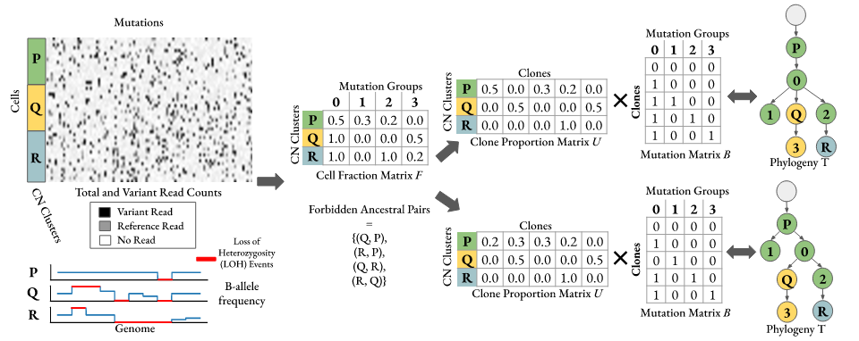

# Exploring the Space of Tumor Phylogenies Consistent with Single-Cell Whole-Genome Sequencing Data


**Overview of SCOPE algorithm.** (a) Single-cell whole genome sequencing (scWGS) ultra-low coverage measurement of mutations in individual cells which enables reliable measurement of copy-numbers but complicates measurement of SNV clones. SCOPE takes a two-step approach to infer tumor phylogenies from scWGS data. (b) First, SCOPE estimates cell fractions of mutations within each copy-number cluster using a probabilistic read counts model and identifies forbidden ancestral pairs D of copy-number clusters. (c) Second, SCOPE enumerates all tumor phylogenies consistent with the estimated cell fractions and forbidden ancestral pairs under a copy-number constrained perfect phylogeny model.


## Overview
- Introduces SCOPE, an algorithmic framework that enumerates all tumor phylogenies supported by ultra-low-coverage scWGS data under copy-number–constrained perfect phylogeny assumptions.

- Uses mutation cell-fraction estimates within copy-number clusters and derives necessary and sufficient constraints that these fractions must satisfy to admit a valid phylogeny.

- Demonstrates improved accuracy and runtime over existing tools on simulations and real scWGS datasets, and quantifies phylogenetic uncertainty across cancer samples by identifying when multiple phylogenies are equally supported by the data.

## Installation

```bash
git clone https://github.com/sashittal-group/SCOPE.git
cd SCOPE
pip install .
```

## Running SCOPE on Ovarian Cancer Dataset
This notebook [SCOPE on Ovarian Cancer Dataset](https://github.com/sashittal-group/SCOPE/blob/master/notebooks/Ovarian%20Cancer%20Dataset.ipynb) shows how to run SCOPE on Ovarian Cancer Dataset. The dataset is from Laks et al. [https://doi.org/10.1016/j.cell.2019.10.026](https://doi.org/10.1016/j.cell.2019.10.026) and can be downloaded from [https://zenodo.org/records/3445364](https://zenodo.org/records/3445364). The smaller files are present in this GitHub repo at [data/laks](https://github.com/sashittal-group/SCOPE/tree/master/data/laks).

## Statistical Tests for Evaluating Phylogenies
The notebook [Hypothesis Tests for Ovarian Cancer Phylogenies](https://github.com/sashittal-group/SCOPE/blob/master/notebooks/Hypothesis%20Tests%20for%20Ovarian%20Cancer%20Phylogenies.ipynb) shows the results from hypothesis test for evaluating clonal relationships inferred from phylogenies from SCOPE and competing methods.

## Running SCOPE and Competing Methods on Simulated Data
The following snakemake file [Snakemake](https://github.com/sashittal-group/SCOPE/blob/master/Snakefile) has the entire pipeline for generating simulating simulation data, preprocessing the data into the input specification for the methods and running the methods on the data. The results are aggregated and compared in the following notebook: [Simulation Results](https://github.com/sashittal-group/SCOPE/blob/master/notebooks/Simulation%20Results.ipynb).


## Running SCOPE on Meta-Cohort Dataset (Funnell, O'Flanagan, Williams et al.)
Download the dataset from Funnell, O'Flanagan, Williams et al. [https://doi.org/10.1038/s41586-022-05249-0](https://doi.org/10.1038/s41586-022-05249-0) using the following commands
```bash
wget -O data/williams/dataset.zip https://zenodo.org/records/6998936/files/signatures_dataset
unzip -d data/williams data/williams/dataset.zip
```

To run SCOPE on this data run the rules `split_inputs_williams`, `make_inputs_williams`, `scope_williams` from the following snakemake file [Snakemake](https://github.com/sashittal-group/SCOPE/blob/master/Snakefile).

The results are visualized in the following notebook: [SCOPE on Meta-Cohort](https://github.com/sashittal-group/SCOPE/blob/master/notebooks/SCOPE%20on%20Meta-Cohort.ipynb).